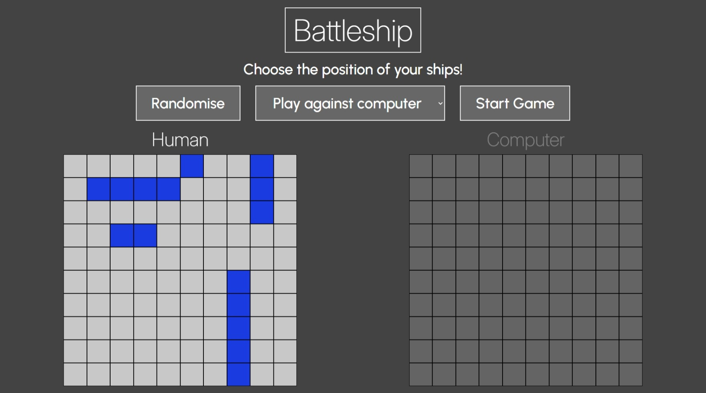
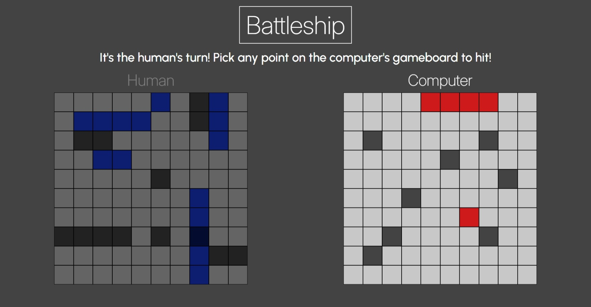
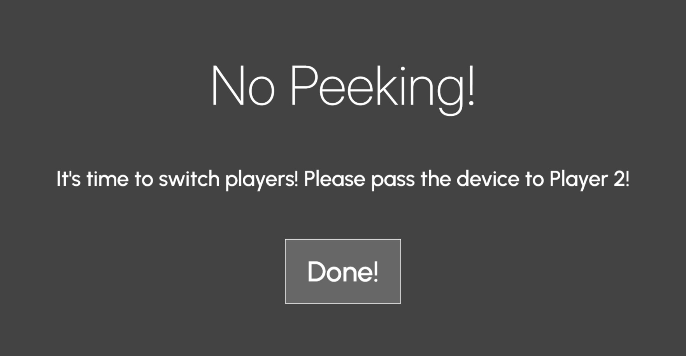
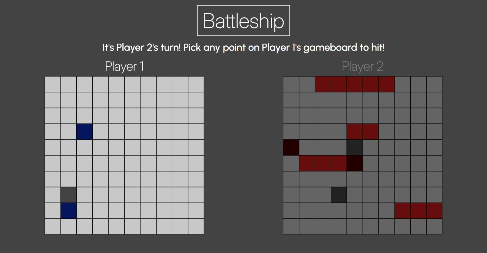

# battleship

Battleship project based on The Odin Project curriculum.

Live demo link: https://j0e-quan.github.io/battleship/

## Technologies used:

- HTML for basic page layout
- CSS for styling and use of web fonts (Inter and Urbanist)
- JavaScript for game code and dynamically rendering game elements
- npm and webpack for managing and bundling code modules
- Git for version control

## Key features:

- Two modes, playing against a computer or second human player
- UI elements are intuitive and dynamically hide/show depending on current player
- "Swap screen" is present to prevent accidentally seeing the other player's ships in two-player mode

## Gallery:

## Getting started:

1. clone this repo in your desired folder: `git clone https://github.com/J0e-Quan/battleship.git`
2. `npm install` to install any required dependencies
3. `npm run dev` to activate the dev server (View the project by navigating to the localhost address shown in your terminal.)
4. `npm run build` will bundle the code into the 'dist' folder
